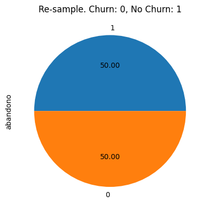
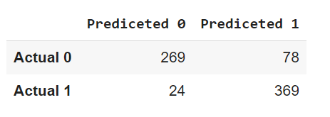
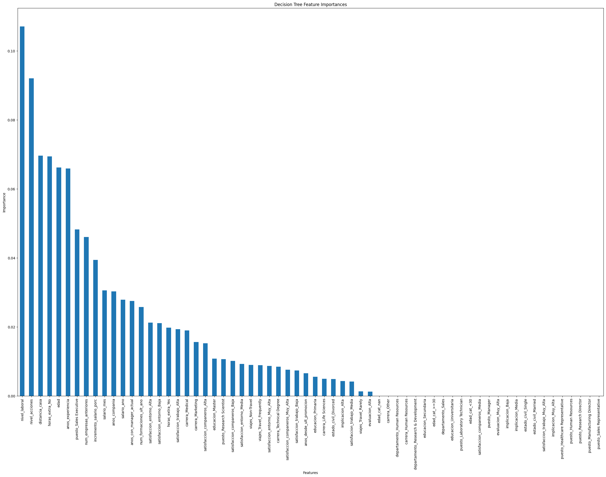

Welcome to my portfolio. I am Samuel, and I invite you to explore my projects. Click on each header to delve into the details of each project. Within each project, you will find the comprehensive scripts I employed for analysis and development.

Thank you for your interest.

# [Project 1: Predicting Employees Churn](https://github.com/SamuelDS1/Data-Science-Portfolio/tree/main/Projects/Project%201:%20Employees%20Churn) 
Employee churn, the phenomenon of employees leaving an organization, poses significant challenges for businesses in terms of productivity, morale, and financial implications. By leveraging the power of data, I have created a predictive model that effectively forecasts the likelihood of employees leaving a company.
Through data analysis, I have identified key factors that contribute to employee attrition, such as the number of companies employees worked for before, monthly compensation and . By using decision trees, and random forests, I have developed a model that can anticipate employees churn with **90% precision**.

## Problem
There´s a lot of employees leaving the company and the directors don't know why. The **objective** is to predict wheter employees churn or stay at the the company so we can reduce losses; we want to know what are the employee's characteristics that make it churn, so that the company can target those problems and act accordingly. This is a **Classification** problem.

At the end we want to present our key findings through a visualization in Tableau.

## Data 
We'll use a Data set called employees. All the rows in the data (1470 observations) represent one employee and describe certain characteristics about it. The data comes from a DS course, you can find it in here [Course](https://ds4b.teachable.com/courses).
**Preprocessing and cleaning** the data was by far the most time-consuming task of the project. The only **data quality issue** encountered was the class inbalance in the churn variable.

## Analysis
The analysis revealed that there's a 16% churn rate.

Further investigation shows that most employees who churned:
*  Had a low educational level.
*  Were single at the time.
*  Worked extra hours.
*  Worked in sales.

### Hypothesis Testing

## The ML Model
To solve the class imbalance issue mentioned at the beggining, I oversampled the smallest group (16% churn rate) to be 50-50 compared with the other group (employees who didn't churn).

I used a **Random Forest Classifier** for this Classification problem; as a Desition Tree is more likely biased. To select the best parameters for the model we used **hyperparameter tuning**, returning: {'max_depth': 9, 'min_samples_split': 4, 'min_samples_leaf': 2}.

## Results 
To identify the model's performance and results we used a ROC AUC score, a confusion matrix and a feature importance graph. 
The models ROC AUC score is **0.90744**. 

The confusion matrix performs really well and doesn't return too many type I and II errors.

Now take a look at the feature importance graph.

Based on this information the potential losses can be up to **$5,470,760 USD**. 

