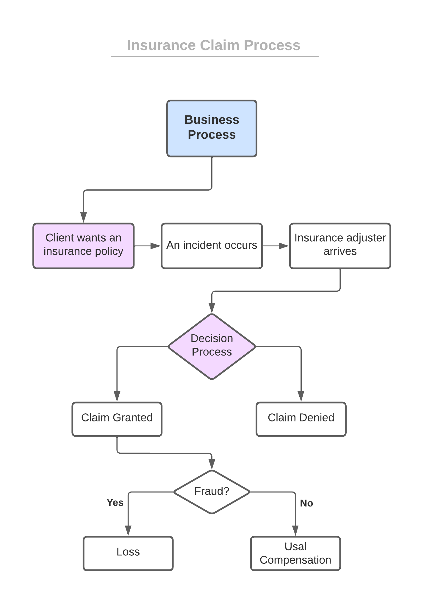
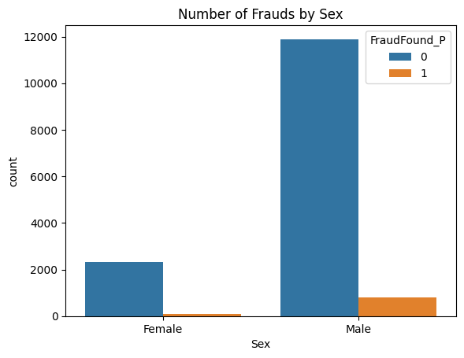
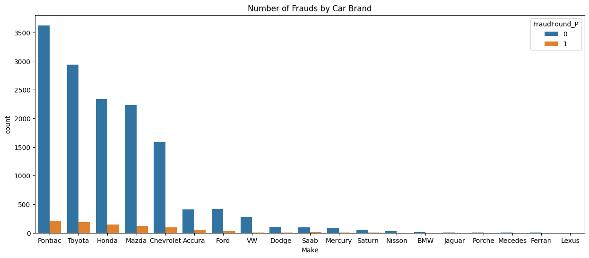
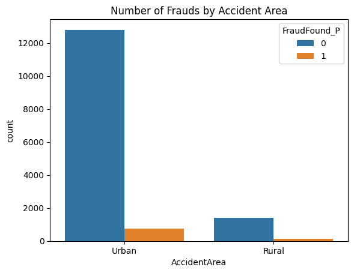
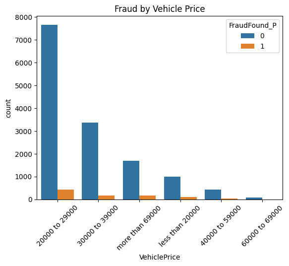
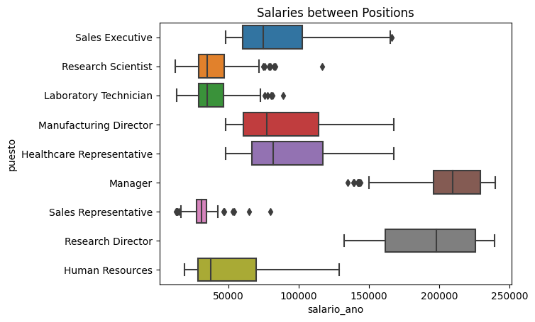
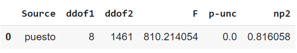
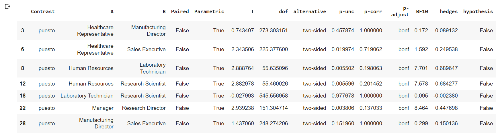
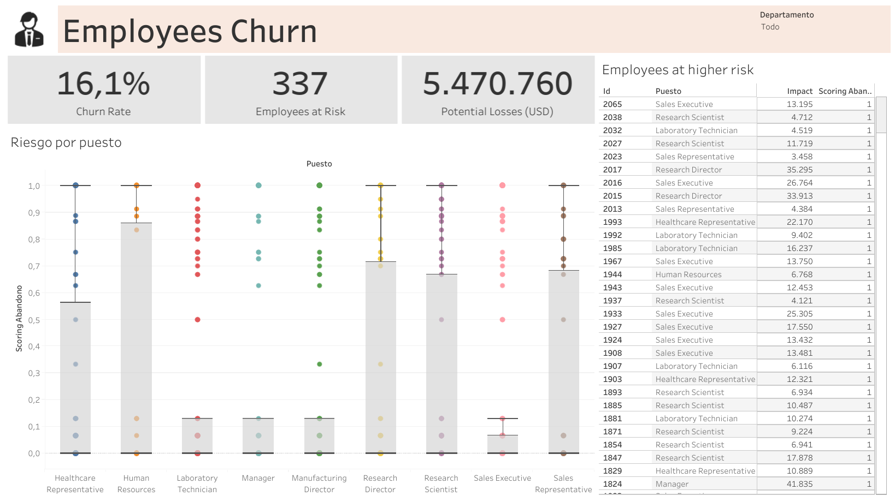

Welcome to my portfolio. I am Samuel, and I invite you to explore my projects. Click on each header to delve into the details of each project. Within each project, you will find the comprehensive scripts I employed for analysis and development.

Thank you for your interest.

# [Project: Predicting Fraud in Insurance Claims](https://github.com/SamuelDS1/Data-Science-Portfolio/tree/main/Projects/Project%3A%20Fraud%20Insurance) 

In the insurance landscape, the battle against fraudulent claims has become a challenge for insurance companies worldwide. As losses incurred due to fraudulent activities continue to mount, it is important for insurance providers to adopt strategies that enable them to distinguish between genuine claims and fraud attempts. This project helps to address this issue by using predictive algorithm techniques to identify and preempt fraudulent insurance claims.

## Problem 
The problem is that fraud is really expensive for the insurance companies. The insurance industry consists of more than 7,000 companies that collect over $1 trillion in premiums each year. The massive size of the industry contributes significantly to the cost of insurance fraud by providing more opportunities and bigger incentives for committing illegal activities. The total cost of insurance fraud (non-health insurance) is estimated to be more than $40 billion per year. That means Insurance Fraud costs the average U.S. family between $400 and $700 per year in the form of increased premiums. [source](https://www.fbi.gov/stats-services/publications/insurance-fraud).
For example, the Federal Bureau of Investigation (FBI) reported COVID-19 related fraudulent insurance claims, where criminals used the confusion caused by the pandemic to file fraud claims.

The **objective** is to understand fraud trends and build a product that analyzes transactions and makes fraud predictions using a Machine Leaening Algorithm.

## The business process.
The next diagram explains the fraudulent claim submition process. There is two moments in which we can make a prediction.

1. Before the company accept to insures
2. During the decision process, when an agent decides whether to grant the claim or not.

## Predicion Frecuency
It can be done in:
1. Batches: If we decide to predict fraud during the decision process, as we have more time to double-check the policy holders information.
2. Real-Time: If we want to make predictions just when the potential customer wants to acquire a policy.

## Data Sources
The dataset contains **15,420 claims**. Each claim has 33 attributes describing the following components:

* Customer demographic details (age, sex, martial status)
* Purchased Policy (policy type, vehicle category, number of supplements, agent type, etc)
* Claim Circumstances (day/month/week claimed, policy report filed, witness present, past days between incident-policy report, incident-claim, etc)
* Other customer data (number of cars, previous claims, driver rating, etc)
* Fraud found (yes; 1 and no; 0)

## Solution
1. EDA
2. Data Preprocessing
3. Feature Engineering
4. Feature selection
5. Train model
6. Model evaluation
7. Product

## Analysis
We want to analyze the data and start creating a profile for the usual fraudster.

### Fraud
The analysis shows that 88% of Frauds are commited by men, while 12% of the frauds left are commited by woman.

The 23.87% of Frauds are from Pontiac cars, 20.85% from Toyotas, 16.59% from Hondas, and the left 38.59% comes from cars brands like Mazda, Chevrolet, Ford, VW and others.

The 85% of Frauds are from claims where the accident happened in an Urban area.

Almost half of Frauds (47.19%) happend with cheap cars, between 20000 - 29000 . The 30000 - 39000 price range takes 19.61% from all frauds.  

# [Project: Predicting Employees Churn](https://github.com/SamuelDS1/Data-Science-Portfolio/tree/main/Projects/Project%3A%20Employees%20Churn) 
Employee churn, the phenomenon of employees leaving an organization, poses significant challenges for businesses in terms of productivity, morale, and financial implications. By leveraging the power of data, I have created a predictive model that effectively forecasts the likelihood of employees leaving a company.
Through data analysis, I have identified key factors that contribute to employee attrition, such as the number of companies employees worked for before, monthly compensation and . By using decision trees, and random forests, I have developed a model that can anticipate employees churn with **90% precision**.

## Problem
There´s a lot of employees leaving the company and the directors don't know why. The **objective** is to predict wheter employees churn or stay at the the company so we can reduce losses; we want to know what are the employee's characteristics that make it churn, so that the company can target those problems and act accordingly. This is a **Classification** problem.

## Data 
We'll use a Data set called employees. All the rows in the data (1470 observations) represent one employee and describe certain characteristics about it. The data comes from a DS course, you can find it in here [Course](https://ds4b.teachable.com/courses).

* **Preprocessing and cleaning** the data was by far the most time-consuming task of the project. 
* The only **data quality issue** encountered was the class inbalance in the churn variable.

## Analysis
The analysis revealed that there's a 16% churn rate.

Further investigation shows that most employees who churned:
*  Had a low educational level.
*  Were single at the time.
*  Worked extra hours.
*  Worked in sales.

### Hypothesis Testing
I wanted to see if theres any job position that's better compensated than others, so I'll use an ANOVA test for this.
First let's take a look at how the salaries dirstribute.
Significance level set to **Alpha = 0.01**.

* **Null hypotheis**: There's no difference in salary between positions.
  *  H0: m1 = m2 = m3 = ... = mn
* **Alternative hypotheis**: At least one mean group is different.

There seems to be some a significal difference in the graphic, but to make sure I'll use ANOVA. 

The p-value 0.00 is lower than Alpha = 0.01. Reject H0 in favor of HA. This is strong evidence that there's at least one mean group that's different. But which ones are different?

After a test we can see that the next job position pairs have different mean salary:

## The ML Model
I used a **Random Forest Classifier** for this Classification problem; as a Desition Tree is more likely biased. To select the best parameters for the model we used **hyperparameter tuning**, returning: {'max_depth': 9, 'min_samples_split': 4, 'min_samples_leaf': 2}.

To solve the class imbalance issue mentioned at the beggining, I oversampled the smallest group (16% churn rate) to be 50-50 compared with the other group (employees who didn't churn).

## Results 
To identify the model's performance and results we used a ROC AUC score, a confusion matrix and a feature importance graph. 
The models ROC AUC score is **0.90744**. 

The confusion matrix performs really well and doesn't return too many type I and II errors.

Now take a look at the feature importance graph.

The Random Forest positions this features as important.
* Job Level: How high are they in the corporation, Directors for example have a high job level. 
* Home distance: How far employees live from the office.
* Extra hours: Whether or not employees work extra hours.
* Works in sales.
* Low Environmental Satisfaction.
* Low Peer Satisfaction.

This is a Data Visualization made in Tableau Public, that can help technical and non-technical steakholders understand the impact of employees leaving the company. Click in [here](https://public.tableau.com/views/employees_churn_data_visualization/Dashboard1?:language=es-ES&:display_count=n&:origin=viz_share_link) to explore the complete interactive visualization.

The product shows risk across positions and **16%** churn rate, **337** employees at risk, and over **$5 million** USD in potential losses. 

