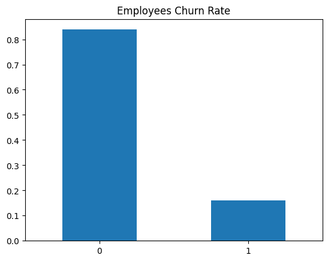
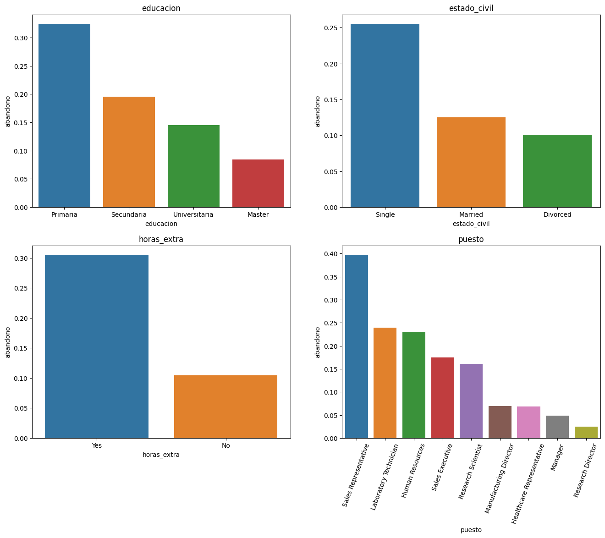

# Data Science Portfolio
Hi! My name is Samuel. Take a look at my porfolio!
Click in each header to see more about each project. If you want to see the scripts I used you'll find them inside each project.  

## [Project 1: Predicting Employees Churn](https://github.com/SamuelDS1/Data-Science-Portfolio/tree/main/Projects/Project%201:%20Employees%20Churn) 
Employee churn, the phenomenon of employees leaving an organization, poses significant challenges for businesses in terms of productivity, morale, and financial implications. By leveraging the power of data, I have created a predictive model that effectively forecasts the likelihood of employees leaving a company.
Through data analysis, I have identified key factors that contribute to employee attrition, such as job satisfaction and compensation. By using decision trees, and random forests, I have developed a model that can anticipate employees churn with **90% precision**.

### Problem to solve
The objective is to predict employees churn so we can reduce it and save money to the company; we want to know what are the characteristics of employees that are most likely to quit.

### Analysis
After cleaning the data the analysis revealed that there's a 16% churn rate.

I also found out that most employees who churned:
*  Had a low educational level.
*  Where single at the time.
*  Worked extra hours.
*  Worked in sales.

